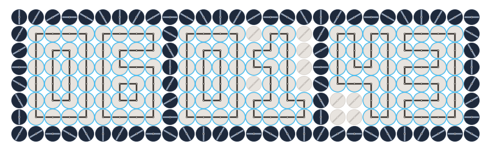

# Hi there! I'm Alexander Borisov
### Full-Stack Developer · PHP / Python / Vue

[Русская версия](docs/ru/README.md)

Self-taught software engineer with **4+ years of commercial experience** at QSOFT (one of the largest IT companies in Russia), delivering **70+ projects** across e-commerce, fintech, and large-scale microservice systems. Grew into a **Team Lead** role — managed developers, mentored juniors, and owned architectural decisions.

Before IT, I spent 8 years working in a hospital — which taught me to stay calm and act fast when production is on fire. That skill came in handy more than once.

> Open to **full-time remote** work or positions **with relocation assistance abroad**.
> Based in Moscow, Russia · Flexible with time zones (comfortable working night shifts if needed)
> Languages: Russian (native) · English A2, actively studying toward B1 · German A2 (in progress)

---

### Tech Stack

**Backend (primary):** PHP — Laravel, Yii2, Bitrix, WordPress
**Backend (secondary):** Python — FastAPI, Flask, Click
**Frontend:** Vue.js, TypeScript, JavaScript, jQuery, SCSS, LESS
**Databases & Cache:** PostgreSQL, MySQL, MariaDB, Redis (incl. query optimization)
**DevOps:** Docker, CI/CD, Linux
**Real-time & Desktop:** WebRTC, Socket.io, Electron
**AI / LLM:** OpenAI, OpenRouter, VseLLM integrations
**Principles:** OOP, SOLID, DRY, Clean Code, PHPStan level 8

---

### Experience Highlights

- **Team Leadership** — Led cross-functional teams of 4+ developers concurrently (10+ engineers total over my career).
- **Mentorship** — Onboarded and mentored 5+ junior/middle developers.
- **Project Volume** — 70+ commercial projects: 12+ Laravel, 5+ Python, 2 Yii2, plus Bitrix/WordPress.
- **High-stakes work** — Built personal data hubs with strict security requirements (anti-exploit hardening, attack mitigation).

---

### Notable Commercial Projects (under NDA)

- **Central Bank of Russia library portal** — large-scale public-facing project.
- **Panavto** — major commercial e-commerce platform.
- **Sharik.ru refactor** — B2B platform for the party goods market.
- **Personal Data Hub (Laravel)** — secure data-routing system with strong protection against attacks and exploits.
- **12-microservice delivery system (Laravel)** — implemented end-to-end delivery flow across warehouse service → website → job-dispatcher → ERP logistics → internal messaging service. One of the most architecturally complex projects I've worked on.
- **AI Review Analyzer** — collected and summarized user reviews from the App Store and Google Play using LLMs.

### Production Firefighting

- **Malware removal under live traffic** — restored core functionality and stopped a self-replicating virus on a production site without taking it offline (client's traffic metrics were critical).
- **DDoS mitigation** — fine-tuned IP whitelist/blacklist systems under active attack.
- **CMS core recovery** — restored a partially deleted CMS core after a failed update, piece by piece from multiple project sources, preserving all client data and orders. This case led the company to introduce a dedicated repository storing CMS core versions across generations.

---

### Open Demo Projects

*Personal projects built to showcase code quality, architecture, and stack integration.*

#### [cms_blog](https://github.com/nerolory/cms_blog)
Production-oriented Laravel 13 CMS blog with an AI sidecar and token billing.
- **Stack:** PHP 8.3, Laravel 13, PostgreSQL, Redis, Filament 4, FastAPI, Docker, Helm
- **Features:** Post CRUD with moderation, RBAC, SEO, Sanctum API, comment analysis and AI summaries for bloggers, mock/production payment gateway for tokens.
- **Quality:** PHPStan L9, 200+ PHPUnit tests, Playwright E2E, Vitest + TypeScript, multi-channel deploy (native, Docker, Kubernetes).

#### [pulsar_ai_manager](https://github.com/nerolory/pulsar_ai_manager)
SPA-based standalone LLM chat application with a desktop installer.
- **Stack:** Python, Vue.js, Docker
- **Features:** Multi-provider LLM router supporting OpenRouter / OpenAI (international) and VseLLM (Russia). Docker-based architecture, easily scalable, packaged as a standalone app with a PC installer.

#### [chronos_event_manager](https://github.com/nerolory/chronos_event_manager)
Comprehensive event management system with an interactive calendar and a Kinetic Watch display (28×8 grid of analog clock faces forming dynamic visuals).

- **Stack:** PHP 8, Laravel, Vue.js, Docker, Composer
- **Quality:** PHPStan level 8 compliant, distributed as a Composer package, easy to integrate into existing Laravel projects.

#### [webhook-router](https://github.com/nerolory/webhook-router)
Demo project for the `nerolory/webhook-router` package — a **framework-agnostic** Composer package for validating and routing webhooks.
- **Stack:** PHP 8, Composer, Docker
- **Features:** Signature verification, IP whitelisting, rate limiting. Production-ready for payment integrations like YooKassa or PayPal.
- **Quality:** PHPStan level 8, fully isolated package architecture.

---

### Currently

Building products with a small team — including a community-focused communication platform and an online meetings/conferencing project. Details under wraps.

---

### Soft Skills

- Calm under pressure (8 years in a hospital before IT — production incidents don't scare me)
- Persistence and attention to detail
- Strong code hygiene — I genuinely care about clean, readable code
- Continuous learner — most of my stack was acquired through self-study and on-the-job growth
- Time-zone flexible — comfortable with non-standard hours when the project needs it

---

### Education

**[GeekBrains](https://geekbrains.ru)** — professional training with certificates.
On-the-job training and internship at QSOFT, including **Bitrix** and **Laravel** courses.
Continuous professional development.

---

### Contact

- **Telegram:** [@Nerolory](https://t.me/Nerolory)
- **Email:** a.borisov.dojo@gmail.com
